# 1-Bit Custom SRAM Column Design & Layout (90nm)

## Project Overview
This project involves the full custom transistor-level design, simulation, and physical layout of a 1-bit SRAM column. Designed using Cadence Virtuoso in the **GPDK 90nm technology node**, the project showcases a bottom-up physical design methodology. Every sub-component was individually drafted and verified before being integrated into a complete, timing-verified memory column hierarchy.

## Key Performance & Verification Metrics
* **Technology Node:** Cadence GPDK 90nm
* **SRAM Cell Layout Area:** 33.19 µm²
* **Physical Verification:** 100% DRC (Design Rule Check) and LVS (Layout Versus Schematic) Clean
* **Simulation:** Precision 100ns transient simulations utilizing Piece-Wise Linear (VPWL) sources to orchestrate complex read/write timing.

---

## 1. 6T SRAM Cell
The core of the memory array. This cross-coupled inverter design holds the data state, accessed via two NMOS pass transistors controlled by the Wordline (WL).
* The schematic was verified for stable read/write operations before layout.
* The layout prioritizes symmetry to perfectly match parasitic capacitances, ensuring read stability. 

**Schematic:**
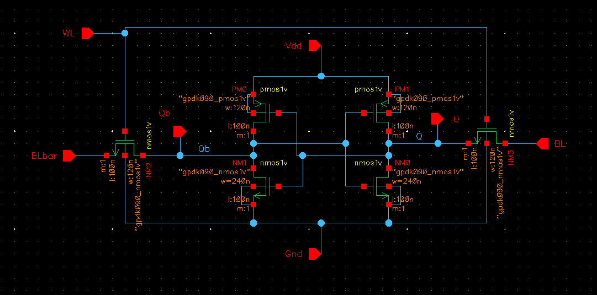
**Transient Output:**
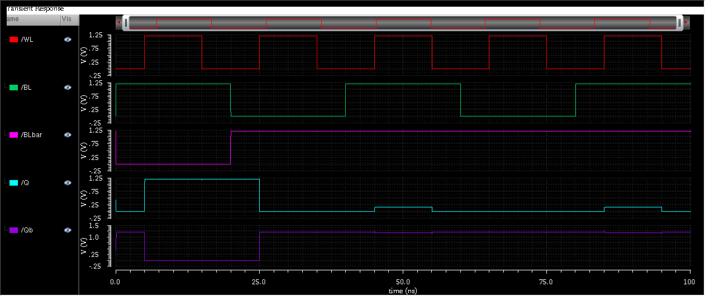
**DC Analysis:**
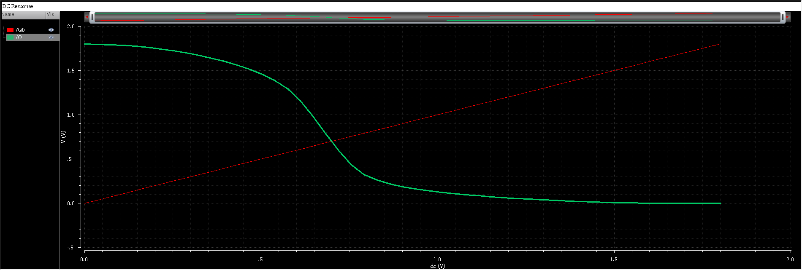
**Butterfly Curve:**
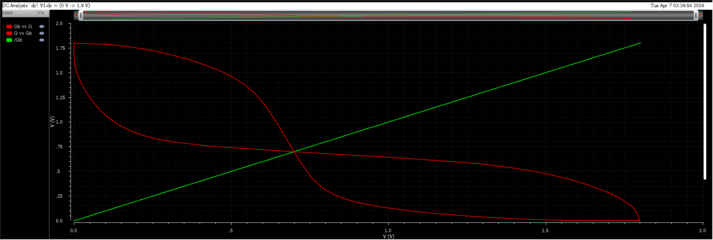

**Physical Layout (DRC/LVS Clean):**
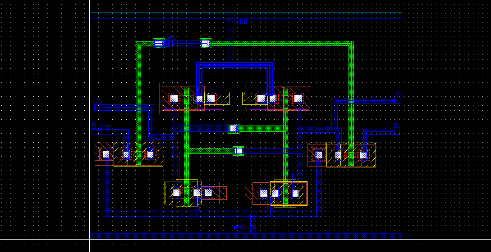

---

## 2. Precharge Circuitry
Before any read or write operation, the highly capacitive bitlines must be equalized. This PMOS-based precharge circuit pulls both `BL` and `BLbar` to exactly 1.2V when the active-low `PCH` signal is asserted.

**Schematic & Transient Output:**
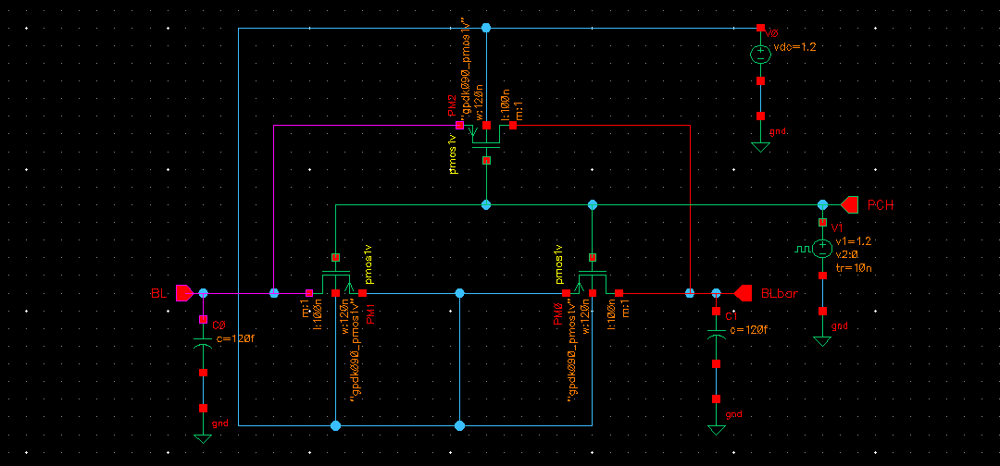
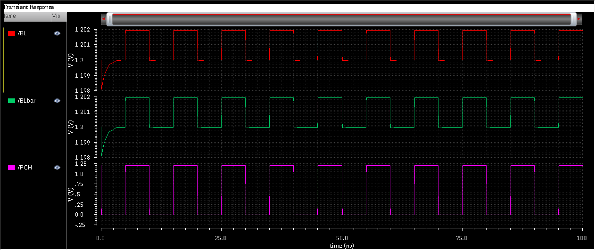

---

## 3. Write Driver
Designed to overpower the 6T SRAM cell during a write operation. When the `EN` (Enable) signal is high, the Write Driver pulls either `BL` or `BLbar` aggressively to Ground (0V) based on the input `DATA`, forcing the 6T cell to flip states.

**Schematic & Transient Output:**
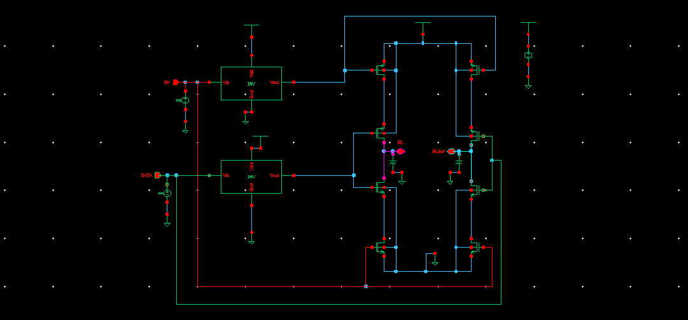
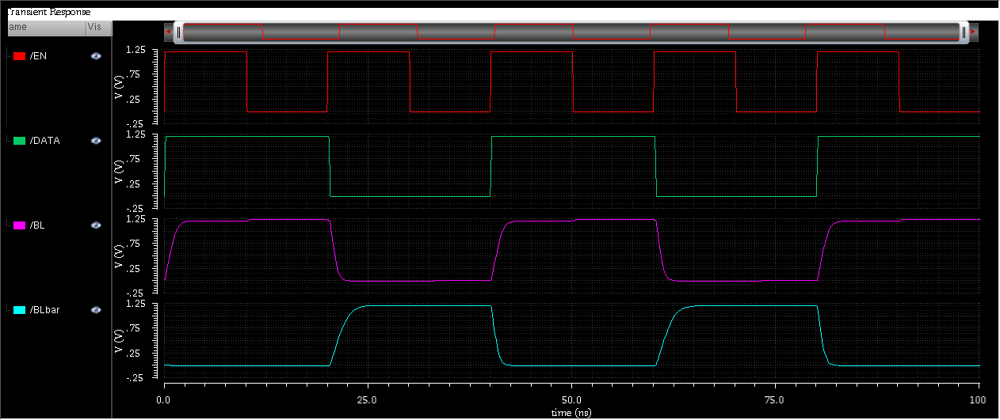

---

## 4. Sense Amplifier
Reading a '1' or '0' relies on detecting a tiny voltage drop (often less than 100mV) on the bitlines. This voltage-latched sense amplifier detects that slight differential and violently amplifies it to a full 0V/1.2V digital logic level when the `SSA` (Sense Amp Enable) signal fires.

**Schematic & Transient Output:**
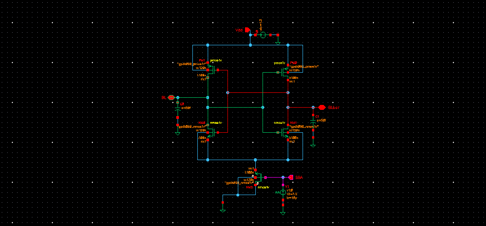
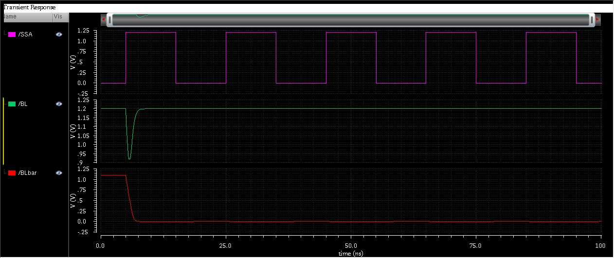

---

## 5. Isolation Circuit
A critical architectural component. The `isolation` block uses NMOS pass transistors to bridge the "heavy" upper bitlines to the "delicate" lower bitlines. By slamming this gate shut right before the sense amplifier fires, the amplifier is protected from the massive parasitic capacitance of the main memory array, allowing for highly accelerated read speeds.

**Schematic & Transient Output:**
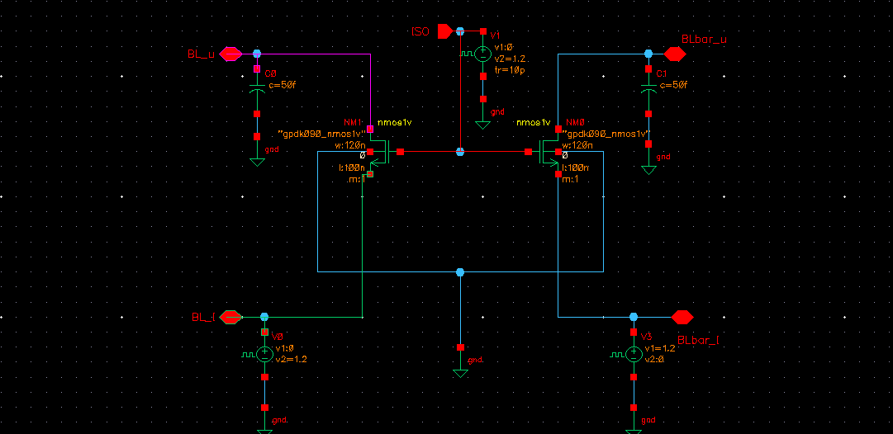
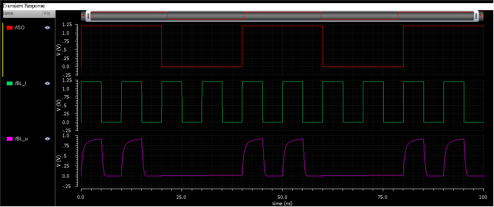
---

## 6. Top-Level Integration & Timing Orchestration
All sub-components are instantiated into a complete 1-bit column hierarchy. Dummy parasitic capacitors (100fF) were added to the upper bitlines to accurately simulate the weight of a larger integrated memory array. 

**Top-Level Column Schematic:**

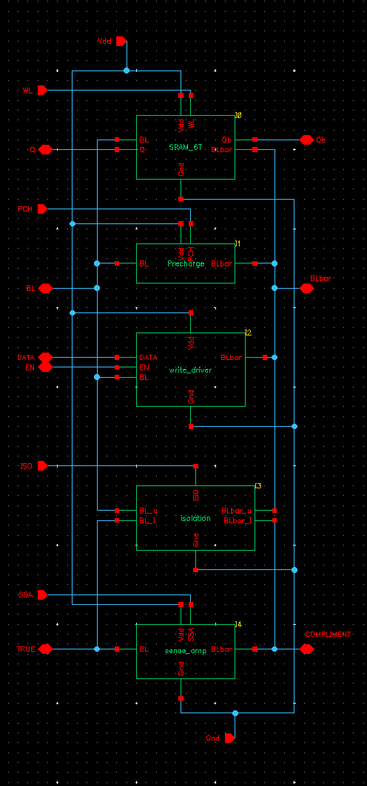

### Master Timing Sequence
To prove the column works realistically, a full master timing sequence was orchestrated using precise nanosecond delays:
1. **Precharge:** `PCH` goes LOW, pulling both bitlines to 1.2V. `ISO` is HIGH to allow the lower bitlines to charge.
2. **Write '1':** `ISO` shuts to protect the sense amp. The Write Driver forcefully pulls `BLbar` to 0V. `WL` opens, overpowering the cell to store a '1'.
3. **Read '1':** `WL` opens and the cell slowly drains `BLbar`. At 30ns, `ISO` slams shut, trapping the small voltage drop. The Sense Amp fires, instantly pulling the output to a full 0V logic level.
4. **Write '0' & Read '0':** The process successfully repeats for the opposite state, completing a full memory cycle.

**Top-Level Transient Verification:**
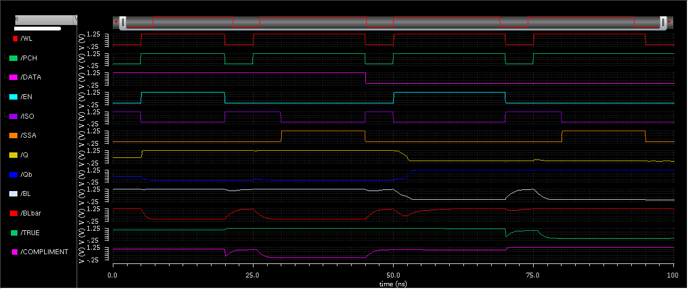

---
*Project completed as part of an advanced Custom IC / VLSI design portfolio.*
